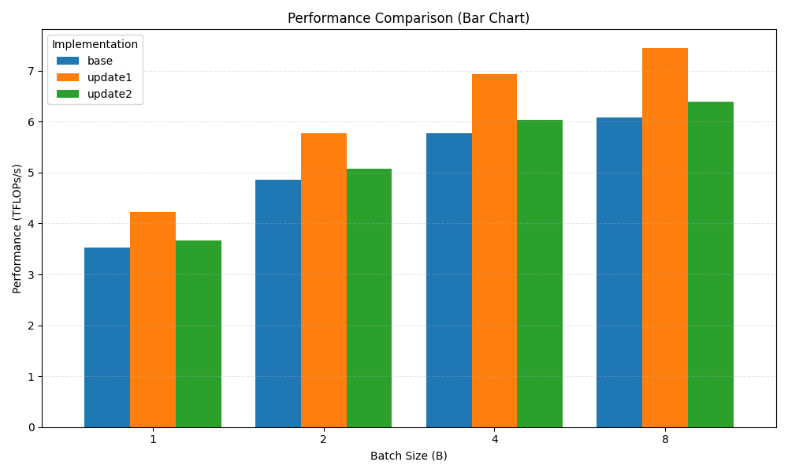

# CUDA GPT-2 training (3 implementations)

This folder contains **three CUDA training programs** for GPT-2 (124M) that differ mainly in how they do the GEMMs (matrix multiplies).

## quick start 

If you won't be training on multiple nodes, aren't interested in mixed precision, and are interested in learning CUDA, the fp32 (legacy) files might be of interest to you. These are files that were "checkpointed" early in the history of llm.c and frozen in time. They are simpler, more portable, and possibly easier to understand. Run the 1 GPU, fp32 code like this:

```
chmod u+x ./dev/download_starter_pack.sh
./dev/download_starter_pack.sh
make train_gpt2fp32cu
./train_gpt2fp32cu
```


The download_starter_pack.sh script is a quick & easy way to get started and it downloads a bunch of .bin files that help get you off the ground. These contain: 1) the GPT-2 124M model saved in fp32, in bfloat16, 2) a "debug state" used in unit testing (a small batch of data, and target activations and gradients), 3) the GPT-2 tokenizer, and 3) the tokenized [tinyshakespeare](https://raw.githubusercontent.com/karpathy/char-rnn/master/data/tinyshakespeare/input.txt) dataset. Alternatively, instead of running the .sh script, you can re-create these artifacts manually as follows:

```
pip install -r requirements.txt
python dev/data/tinyshakespeare.py
python train_gpt2.py
```


## Files

- `train_gpt2_fp32.cu`  
  **Base** implementation. Uses a custom CUDA matmul kernel for `matmul_forward` (plus cuBLAS in other places like attention/backward).
- `train_gpt2_fp32_update1.cu`  
  **Update1**: switches `matmul_forward` to **cuBLAS SGEMM** (`cublasSgemm`) + a separate bias-add kernel.
- `train_gpt2_fp32_update2.cu`  
  **Update2**: keeps most things FP32, but changes the **MLP FC (the first MLP linear: `fcw`)** to run as
  **FP16 inputs/weights with FP32 accumulation/output** via `cublasGemmEx` 

---

## Requirements

- NVIDIA GPU + driver
- CUDA Toolkit (nvcc)
- cuBLAS (comes with CUDA)
- (Optional) NCCL **only** if you enable multi-GPU (not needed on a single 3060)

---

## Required assets (paths are relative to repo root)

- Checkpoint: `gpt2_124M.bin`
- Tokenizer: `gpt2_tokenizer.bin`
- Training data: `dev/data/tinyshakespeare/tiny_shakespeare_train.bin`
- Validation data: `dev/data/tinyshakespeare/tiny_shakespeare_val.bin`

---

## Build

### build with Makefile (single-GPU)

```bash
cd ~/llm/llm.c
make clean
make train_gpt2_fp32 NO_MULTI_GPU=1
```

### Minimal examples

From repo root:

```

# Base 
./train_gpt2_fp32 -b 4 -t 256 

# Update1 
./train_gpt2_fp32_update1 -b 4 -t 256 

# Update2 
./train_gpt2_fp32_update2 -b 4 -t 256 
```

## Output



